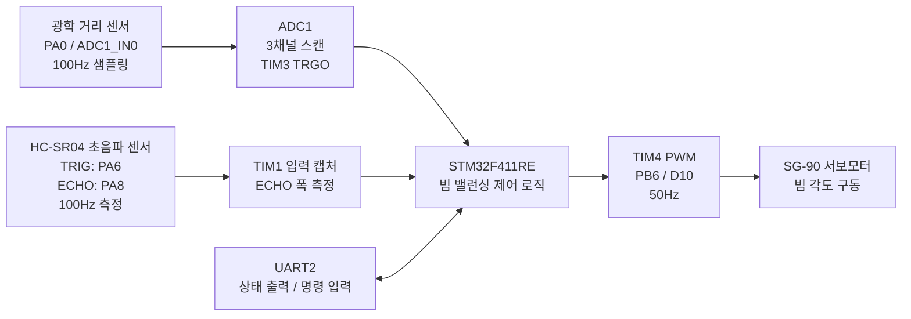
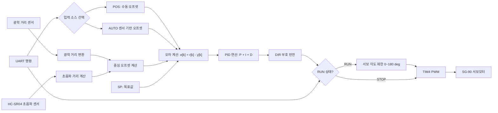

# 2026-01-BeamBalancing 프로젝트 문서

최초 작성: 2026-04-06 19:31:41 KST  
최종 수정: 2026-05-08 KST

## 1) 문서 목적
본 문서는 STM32F411RE Nucleo-64 기반 2026-01-BeamBalancing 프로젝트의 현재 동작 정리 문서임.

- 다중 채널 ADC(3채널) + TIM3 외부 트리거 샘플링
- TIM4 PWM(50Hz) 기반 SG-90 제어
- UART 명령 인터페이스 기반 모드 선택/런타임 제어
- TIM1 Input Capture 기반 HC-SR04 초음파 거리 측정 (100Hz, 인터럽트)
- USART2 RX 인터럽트 + 링버퍼 방식으로 STOP 명령 유실 문제 수정

## 목차

- [1) 문서 목적](#1-문서-목적)
- [시스템 구성도](#시스템-구성도)
- [PID 제어 블럭도](#pid-제어-블럭도)
- [배선도 작성용 연결표](#배선도-작성용-연결표-핵심)
- [2) 적용 파일](#2-적용-파일)
- [3) 현재 핵심 기능](#3-현재-핵심-기능)
- [4) ADC 샘플링 구성](#4-adc-샘플링-구성)
- [6) Servo PWM 구성](#6-servo-pwm-구성)
- [7) HC-SR04 초음파 거리 측정](#7-hc-sr04-초음파-거리-측정-tim1-input-capture)
- [8) UART RX 인터럽트 방식](#8-uart-rx-인터럽트-방식-링버퍼)
- [9) 런타임 동작 개요](#9-런타임-동작-개요)
- [10) UART 출력 예시](#10-uart-출력-예시)
- [11) CubeMX(.ioc) 반영 상태](#11-cubemxioc-반영-상태)
- [12) 핀맵](#12-핀맵-stm32f411re-nucleo-64)
- [13) 빌드](#13-빌드)
- [14) 주의 사항](#14-주의-사항)

## 시스템 구성도 

아래 구성도는 현재 시스템의 센서 입력, 제어 출력, 내부 처리 흐름을 발표자료용으로 단순화해 표현한 것임.



구성 요약:
- 광학 거리 센서는 ADC1로 읽고, 초음파 거리 센서는 TIM1 입력 캡처로 읽는다.
- 두 센서 입력은 MCU 내부에서 최신값으로 유지되며, 제어 판단에 사용된다.
- 제어 출력은 TIM4 PWM을 통해 SG-90 서보모터로 전달된다.
- UART2는 디버그 출력과 사용자 명령 입력을 담당한다.

## PID 제어 블럭도

아래 블럭도는 현재 프로젝트에서 PID 제어가 실제로 어떤 순서로 동작하는지 요약한 것이다.



PID 구현 흐름:
- `POS:<cm>` 또는 `AUTO`로 제어에 사용할 현재 오프셋을 선택한다.
- `SP:<cm>`로 목표 오프셋을 정하고, 오차 $e[k] = r[k] - y[k]$를 계산한다.
- `KP`, `KI`, `KD`는 각각 비례, 적분, 미분 항의 크기를 조절한다.
- `DIR:+/-`는 계산된 제어량의 방향을 뒤집거나 유지하는 역할을 한다.
- `RUN` 상태에서만 10ms 주기로 PID 갱신이 진행되며, `STOP` 상태에서는 출력만 멈춘다.
- 최종 제어량은 90도 기준에서 더하고 빼서 서보 각도로 바꾸며, 0도~180도 범위로 제한한다.
- `RESET`은 적분값과 이전 오차를 초기화하여 재시작 시 과도한 누적 영향을 줄인다.

발표용 짧은 요약:
- 센서에서 현재 중심 오프셋을 구한다.
- 목표값과의 차이로 오차를 만든다.
- 오차를 PID(P, I, D)로 보정해서 서보 각도를 계산한다.
- `RUN`일 때만 보정이 실제 출력되고, `STOP`일 때는 출력만 멈춘다.

이 구조는 코드에서 `GetPidMeasurementOffsetCm()`, `ResetPidController()`, `UpdatePidControl()` 순서로 구현되어 있다.

PID 수식과 코드 대응표:

| 수식/동작 | 의미 | 코드 대응 |
|---|---|---|
| $y[k]$ | 현재 중심 오프셋 | `GetPidMeasurementOffsetCm()` |
| $r[k]$ | 목표 오프셋 | `g_pid.setpoint_cm` |
| $e[k] = r[k] - y[k]$ | 현재 오차 | `UpdatePidControl()` |
| $I[k] = I[k-1] + e[k]\Delta t$ | 적분 항 누적 | `g_pid.integral` |
| $D[k] = \frac{e[k]-e[k-1]}{\Delta t}$ | 미분 항 계산 | `g_pid.prev_error` 와 `UpdatePidControl()` |
| $u[k] = s\cdot(K_p e[k] + K_i I[k] + K_d D[k])$ | 제어량 계산 | `g_pid.kp`, `g_pid.ki`, `g_pid.kd`, `g_pid.output_direction_sign` |
| $\theta[k] = \mathrm{clamp}(90 + u[k], 0, 180)$ | 서보 각도 변환 | `SetServoAngleRaw()` |
| `RUN` / `STOP` | 제어 실행 게이트 | `g_pid.control_enabled` |
| `RESET` | 적분/이전오차 초기화 | `ResetPidController()` |

## 배선도 작성용 연결표 (핵심)

아래 표를 기준으로 실제 배선도를 작성하면 됩니다.

| 대상 | 센서/모듈 핀 | MCU 핀 | 보드 핀명 | 비고 |
|---|---|---|---|---|
| Optical distance sensor | AOUT | PA0 (ADC1_IN0, Rank1) | A0 | 주 측정 입력 |
| Optical distance sensor (옵션) | AOUT2 | PA1 (ADC1_IN1, Rank2) | A1 | 보조 입력 |
| Optical distance sensor (옵션) | AOUT3 | PA4 (ADC1_IN4, Rank3) | A2 | 보조 입력 |
| SG-90 서보 | SIG | PB6 (TIM4_CH1) | D10 | PWM 50Hz |
| HC-SR04 | TRIG | PA6 (GPIO Out) | D12 | 10us 펄스 출력 |
| HC-SR04 | ECHO | PA8 (TIM1_CH1 Input Capture) | D7 | 입력 캡처 |
| UART 로그/명령 | TX | PA2 (USART2_TX) | D1 | PC 수신 측 |
| UART 로그/명령 | RX | PA3 (USART2_RX) | D0 | PC 송신 측 |

배선 전원/접지 규칙:
- SG-90 VCC는 외부 5V 권장, SG-90 GND와 보드 GND는 반드시 공통 접지
- HC-SR04 VCC는 5V 사용 가능, HC-SR04 GND와 보드 GND 공통 접지
- HC-SR04 ECHO(5V)는 PA8(3.3V 입력)에 직접 연결하지 말고 저항 분배기 사용 권장 (예: 1k/2k)

배선도 작성 체크리스트:
- ADC0(주센서)는 반드시 PA0/A0에 연결
- SG-90 신호선은 PB6/D10에 연결
- HC-SR04는 TRIG=D12, ECHO=D7로 분리 연결
- 모든 모듈의 GND를 단일 공통 GND로 묶기

회로도 툴 작업 파일:
- `schematic_netlist.csv`: 회로도 툴에 옮겨 그리기 위한 네트 연결표
- `schematic_parts.md`: 부품 ID/레벨변환/전원 규칙 정리

## 2) 적용 파일
- Core/Src/main.c
- Core/Src/stm32f4xx_hal_msp.c
- Core/Src/stm32f4xx_it.c
- Core/Inc/main.h
- 2026-01-BeamBalancing.ioc
- cmake/gcc-arm-none-eabi.cmake

## 3) 현재 핵심 기능

### 3.1 부팅 모드 선택
부팅 직후 UART에서 모드 선택 수행.

- `1`: ADC 모드
- `2`: Servo 모드
- `0`: About 모드
- `3`: PID 모드

출력 예:
- `=== Mode Select ===`
- `0: About      - brief program overview`
- `1: ADC Mode   - 3ch raw data CSV output`
- `2: Servo Mode - command interface (A, STOP, CMIN, CMAX, STATUS, HELP)`
- `3: PID Mode   - offset-based PID position control`

### 3.1 About 모드
최상위 메뉴에서 `0`을 누르면 프로그램의 간단한 설명이 출력되고, 다시 모드 선택 화면으로 돌아간다.

About 출력 예:

- `BeamBalancing: STM32F411RE beam balance control demo`
- `ADC mode     : GP2Y0A41SK0F optical distance + HC-SR04 distance`
- `Servo mode   : SG-90 angle control and calibration`
- `PID mode     : offset-based PID position control`
- `Commands     : 0=About, 1=ADC, 2=Servo, 3=PID`

### 3.2 ADC 모드 명령 인터페이스
ADC 모드 진입 후 `Input>` 프롬프트에서 아래 명령 지원.

- `START`: CSV 스트리밍 출력 활성화
- `STOP`: CSV 스트리밍 출력 비활성화
- `STATUS`: ADC 상태 출력
- `BACK`: 모드 선택 화면으로 복귀
- `HELP`: 도움말 출력

CSV 출력 형식:
- `ch0_raw,optical_cm,ultra_cm`

광학 거리 센서 값은 SHARP GP2Y0A41SK0F의 일반 특성 곡선을 기준으로 ADC 전압을 4~30cm 범위의 거리로 근사 변환한다.

광센서 환산은 다음 순서로 계산한다.

$$
V_{adc} = \frac{raw}{4095} \cdot V_{ref}
$$

$$
d_{opt} = f_{GP2Y0A41SK0F}(V_{adc})
$$

여기서 $raw$는 ADC 원시값, $V_{ref}$는 기준 전압(이 프로젝트에서는 3.3V), $f_{GP2Y0A41SK0F}$는 데이터시트의 일반 출력 곡선을 구간 선형 보간으로 근사한 함수이다.

이 방식은 센서 출력이 비선형이기 때문에, 단순 직선식보다 실제 거리와 더 가깝게 계산할 수 있다.

### 3.3 Servo 모드 명령 인터페이스
Servo 모드 진입 후 `Input>` 프롬프트에서 아래 명령 지원.

- `A<deg>`: 각도 설정(`A0` ~ `A180`)
- `STOP`: 서보를 중립 각도(`A90`)로 이동
- `CMIN:<us>`: 0도 펄스폭 설정(`500`~`3000`)
- `CMAX:<us>`: 180도 펄스폭 설정(`500`~`3000`)
- `STATUS`: 현재 각도/펄스폭 상태 출력
- `BACK`: 모드 선택 화면으로 복귀
- `HELP`: 도움말 출력

서보 초기값:
- 초기 각도: `90 deg`
- 기본 캘리브레이션: `CMIN=500us`, `CMAX=2500us`

### 3.4 PID 모드 명령 인터페이스
PID 모드 진입 후 `PID>` 프롬프트에서 아래 명령 지원.

- `POS:<cm>`: 현재 공의 중심 오프셋을 사용자가 직접 입력
- `AUTO`: 센서 기반 오프셋을 사용
- `RUN`: PID 제어 시작
- `STOP`: PID 제어 정지
- `SP:<cm>`: 목표 오프셋 설정(기본값 `0`)
- `KP:<v>`: 비례 게인 변경
- `KI:<v>`: 적분 게인 변경
- `KD:<v>`: 미분 게인 변경
- `DIR+/-` 또는 `DIR:+/-`: 제어 출력 방향 변경
- `RESET`: 적분/미분 상태 초기화
- `STATUS`: PID 상태 출력
- `BACK`: 모드 선택 화면으로 복귀
- `HELP`: 도움말 출력

PID 제어에서 현재 위치 오차는 공의 중심 오프셋으로 정의한다.

광학 거리 센서를 왼쪽, 초음파 센서를 오른쪽으로 둘 때 측정 오프셋 $y$는 다음과 같다.

$$
y = \frac{d_{optical} - d_{ultra}}{2}
$$

사용자가 직접 오프셋을 입력하면 그 값을 그대로 $y$로 사용하고, `AUTO` 모드에서는 센서에서 계산한 $y$를 사용한다.

PID 오차와 제어량은 아래와 같다.

$$
e[k] = r[k] - y[k]
$$

$$
I[k] = I[k-1] + e[k]\Delta t
$$

$$
D[k] = \frac{e[k] - e[k-1]}{\Delta t}
$$

$$
u[k] = s \cdot \bigl(K_p e[k] + K_i I[k] + K_d D[k]\bigr)
$$

여기서 $r[k]$는 목표 오프셋이고, $s \in \{+1, -1\}$는 사용자가 설정하는 방향 부호이다. 이 프로젝트의 기본 목표는 $0cm$이다. 제어 출력 $u[k]$는 서보 각도 보정값으로 해석하며, 최종 서보 각도는 다음처럼 계산한다.

$$
  heta[k] = \mathrm{clamp}(90 + u[k], 0, 180)
$$

이 구조는 공이 정중앙에 있을 때 서보 기준각을 `90 deg`로 보고, 그 주변으로 상하/좌우 보정하는 방식이다.

예시:

- `POS:3.5`는 공 중심이 가운데보다 `+3.5cm` 왼쪽이라고 가정한 입력이다.
- `SP:0`은 정중앙 유지 목표를 의미한다.
- `KP:5.0`, `KI:0.0`, `KD:0.0`은 우선 비례 제어로만 동작시키는 기본 시작점이다.
- `DIR:+`는 오차가 양수일 때 서보 보정이 +방향으로 가도록 한다.
- `DIR:-`는 오차가 양수일 때 서보 보정이 -방향으로 가도록 반전한다.

PID 시작 시에는 서보를 중립 각도(`90 deg`)로 맞추고, 이후 10ms 단위로 제어량을 갱신한다.
PID 모드에 들어가면 처음에는 `STOP` 상태이며, `RUN`을 입력해야 실제 제어가 동작한다.
`STOP`은 제어 출력을 멈추는 명령이고, `SP`, `KP`, `KI`, `KD`, `DIR`, `POS`, `AUTO`는 정지 상태에서도 수정 가능하다.
`RUN`을 다시 입력하면 현재 설정값으로 제어를 재개한다.

## 4) ADC 샘플링 구성

### 4.1 ADC 설정
- ADC1, 12-bit, Scan mode enabled
- External trigger: TIM3 TRGO (rising edge)
- Number of conversion: 3
- EOC selection: single conversion

채널 순서:
- Rank 1: ADC_CHANNEL_0 (PA0)
- Rank 2: ADC_CHANNEL_1 (PA1)
- Rank 3: ADC_CHANNEL_4 (PA4)

### 4.2 샘플링 주기(TIM3)
- Prescaler = 8399
- Period = 99
- TRGO = Update event

계산:
- TIM3 clock = 84MHz
- Counter clock = 84MHz / (8399 + 1) = 10kHz
- Update period = (99 + 1) / 10kHz = 10ms
- Sampling rate = 100Hz

## 6) Servo PWM 구성

### 6.1 TIM4 PWM
- TIM4 CH1 (PB6)
- Prescaler = 83
- Period = 19999
- PWM frequency = 50Hz(20ms)

계산:
- TIM4 clock = 84MHz
- Counter clock = 84MHz / (83 + 1) = 1MHz (1 tick = 1us)
- Period = 20000us = 20ms = 50Hz

### 6.2 각도 -> 펄스폭 변환
서보 펄스폭 계산식은 아래와 같음.

- `pulse_us = CMIN + ((angle * (CMAX - CMIN)) / 180)`

범위:
- angle: 0~180
- CMIN/CMAX: 500~3000us (단, CMIN < CMAX)

### 6.3 두 센서로 공의 중앙 위치 계산

광학 거리 센서와 초음파 센서가 공의 양쪽에서 서로 마주보는 구성이라면, 각 센서는 공의 표면까지의 거리를 읽는다고 볼 수 있다.

왼쪽 센서가 측정한 거리와 오른쪽 센서가 측정한 거리를 각각 $d_L$, $d_R$라고 하자. 두 센서 사이의 가운데를 기준점으로 잡으면, 공 중심의 가운데 기준 오프셋 $\delta$는 다음과 같다.

$$
\delta = \frac{d_L - d_R}{2}
$$

의미는 다음과 같다.

- $\delta > 0$이면 공 중심이 왼쪽 센서 쪽으로 치우쳐 있다.
- $\delta < 0$이면 공 중심이 오른쪽 센서 쪽으로 치우쳐 있다.
- $\delta = 0$이면 공 중심이 정확히 가운데에 있다.

이 식에서 공의 지름은 직접 들어가지 않는다. 양쪽 센서가 모두 공 표면까지의 거리를 측정하므로, 중심 오프셋을 구할 때 공 반지름 항이 서로 소거되기 때문이다.

센서 사이 전체 거리 $D$를 알고 있고, 가운데가 아니라 왼쪽 센서 기준으로 공 중심 위치 $x$를 구하고 싶다면 다음처럼 쓸 수 있다.

$$
x = \frac{D + d_L - d_R}{2}
$$

가운데 기준 오프셋은 결국 $x - \frac{D}{2}$와 같고, 정리하면 다시 $\frac{d_L - d_R}{2}$가 된다.

이 프로젝트에서는 광학 거리 센서를 왼쪽, 초음파 센서를 오른쪽으로 두고 다음 함수를 사용한다.

$$
\delta = \frac{d_{optical} - d_{ultra}}{2}
$$

예시:

- 광학 센서가 12cm, 초음파 센서가 18cm이면 $\delta = -3cm$ 이므로 공은 오른쪽으로 3cm 치우쳐 있다.
- 광학 센서가 20cm, 초음파 센서가 10cm이면 $\delta = +5cm$ 이므로 공은 왼쪽으로 5cm 치우쳐 있다.

코드에서는 이 값을 `center` 또는 `center offset`으로 표시해, 공이 가운데에서 어느 쪽으로 얼마나 벗어났는지 바로 확인할 수 있다.

## 7) HC-SR04 초음파 거리 측정 (TIM1 Input Capture)

### 7.1 개요
TIM1을 이용하여 HC-SR04 초음파 센서를 100Hz 주기로 연속 측정한다.  
측정 결과는 `g_hcsr04_dist_cm` (float) 변수에 인터럽트 내에서 갱신된다.

### 7.2 핀 배정

| 신호 | MCU 핀 | 방향 | 설정 |
|------|--------|------|------|
| TRIG | PA6 | Output | GPIO_Output, Push-Pull |
| ECHO | PA8 | Input | TIM1_CH1, AF1, Pull-Down |

### 7.3 TIM1 타이머 설정

| 파라미터 | 값 | 비고 |
|----------|----|------|
| 클럭 소스 | APB2 TIM clock (84MHz) | |
| Prescaler | 83 | 84MHz / 84 = **1MHz** (1 tick = 1µs) |
| Period (ARR) | 9999 | 10000 tick = **10ms = 100Hz** |
| CH1 모드 | Input Capture | ECHO 엣지 시각 측정 |
| CH2 모드 | Output Compare TIMING | TRIG 10µs 펄스 종료 타이밍 |

### 7.4 측정 동작 원리 (인터럽트 기반)

HC-SR04는 10µs 이상의 TRIG 펄스를 보내면, ECHO 핀을 HIGH로 올렸다가 초음파가 반사되어 돌아오는 시간만큼 HIGH를 유지한 후 LOW로 내린다.  
거리는 ECHO HIGH 폭(µs)을 58로 나누면 cm 단위로 환산된다.

```
distance_cm = ECHO_width_us / 58.0
```

인터럽트 처리 흐름:

```
[TIM1 Update IRQ - 10ms마다]
  1. 이전 측정 미완료 시 → ECHO_IDLE 리셋
  2. TRIG = HIGH

[TIM1 CH2 OC IRQ - Update로부터 10µs 후]
  3. TRIG = LOW  (10µs 펄스 완료)

[TIM1 CH1 IC IRQ - ECHO 상승 엣지]
  4. 카운터값 저장 → g_echo_start_us
  5. 캡처 극성을 하강 엣지로 전환

[TIM1 CH1 IC IRQ - ECHO 하강 엣지]
  6. 카운터값 읽기 → echo_end
  7. 폭 계산: width = echo_end - g_echo_start_us
     (카운터 랩오버 시: width = ARR - start + end + 1)
  8. g_hcsr04_dist_cm = width / 58.0f
  9. 캡처 극성을 상승 엣지로 복원
```

### 7.5 카운터 랩오버 보정
ECHO 측정 도중 TIM1 카운터가 ARR(9999)에서 0으로 넘어가는 경우, 단순 뺄셈이 음수가 되므로 아래와 같이 보정한다.

```c
if (echo_end >= g_echo_start_us)
    width_us = echo_end - g_echo_start_us;
else
    width_us = (HCSR04_TIM_ARR - g_echo_start_us) + echo_end + 1U;
```

최대 측정 가능 거리:
- 10ms 내 왕복 가능 거리 = 10ms / 2 × 34300 cm/s ≈ **171 cm**

### 7.6 NVIC 우선순위

| IRQ | 우선순위 | 비고 |
|-----|---------|------|
| TIM1_UP_TIM10_IRQn | 2, 0 | Update + TRIG 생성 |
| TIM1_CC_IRQn | 2, 0 | CH1 IC + CH2 OC |
| ADC_IRQn | 0, 0 | ADC 변환 완료 |
| USART2_IRQn | 1, 0 | UART RX |

### 7.7 관련 전역 변수

| 변수 | 타입 | 설명 |
|------|------|------|
| `g_hcsr04_dist_cm` | `volatile float32_t` | 최신 측정 거리 (cm) |
| `g_echo_width_us` | `volatile uint32_t` | 최신 ECHO 폭 (µs) |
| `g_echo_start_us` | `volatile uint32_t` | ECHO 상승 엣지 캡처값 |
| `g_echo_state` | `volatile EchoState_t` | ECHO_IDLE / ECHO_RISING |

## 8) UART RX 인터럽트 방식 (링버퍼)

### 8.1 변경 배경
ADC 모드에서 CSV를 연속 출력하는 동안, UART 수신을 폴링(`HAL_UART_Receive` timeout=0)으로만 처리하면 `STOP` 등 다중 바이트 명령이 RX 오버런으로 유실되는 문제가 있었다.

### 8.2 해결 방법
`HAL_UART_Receive_IT`를 이용한 1바이트 인터럽트 수신 + 소프트웨어 링버퍼 방식으로 전환.

동작 흐름:
1. 부팅 시 `HAL_UART_Receive_IT` 1회 호출로 수신 시작
2. 바이트 수신마다 `HAL_UART_RxCpltCallback` 호출 → 링버퍼에 push → 즉시 재등록
3. `ProcessAdcInput` / `ProcessServoInput`에서 링버퍼 pop으로 명령 파싱
4. UART 에러 발생 시 `HAL_UART_ErrorCallback`에서 플래그 클리어 후 재등록

링버퍼 크기: 64바이트 (`UART_RX_RING_SIZE`)

## 9) 런타임 동작 개요

### 9.1 공통 초기화
1. GPIO/UART/ADC/TIM1/TIM3/TIM4 초기화
2. TIM4 PWM 시작
3. ADC 큐/서보 초기 상태 설정
4. TIM3 시작 (ADC 트리거 타이머)
5. UART RX 인터럽트 시작
6. ADC 인터럽트 시작
7. TRIG 핀 초기 LOW 설정
8. TIM1 CH1 IC 인터럽트 시작 (ECHO 캡처)
9. UART 모드 선택

### 9.2 메인 루프
- Servo 모드: UART 명령 처리(`A`, `STOP`, `CMIN`, `CMAX`, `STATUS`, `HELP`)
- ADC 모드: UART 명령 처리(`START`, `STOP`, `STATUS`, `BACK`, `HELP`) + 큐 pop/CSV 출력
- ADC 모드 CSV: CH0 raw, 광학 거리(cm), 초음파 거리(cm)
- ADC 모드 상태: 광학 거리(cm), 중심 오프셋(cm)
- PID 모드: `PID>` 명령 처리 + 10ms PID 갱신 + 서보 각도 보정
- PID 모드: `PID>` 명령 처리 + `RUN/STOP`로 제어 시작/정지 + 10ms PID 갱신 + 서보 각도 보정
- PID 모드 상태: 기본 `STOP`, `RUN` 시 제어 시작, `STOP` 시 제어 정지
- HC-SR04 거리 측정: 인터럽트 전용 (메인 루프 비점유), `g_hcsr04_dist_cm` 읽기만 하면 됨

`BACK`을 입력하면 현재 모드를 종료하고 초기 모드 선택 화면으로 돌아간다.

## 10) UART 출력 예시

### 10.1 ADC 모드
- `Input> STATUS`
- `[ADC STATUS]`
- `stream    : ON`
- `sample    : 100 Hz`

### 10.2 Servo 모드
- `Input> A90`
- `Angle set: 90 deg (1500us)`
- `Input> CMIN:600`
- `CMIN = 600 us (CMAX = 2500 us)`

## 11) CubeMX(.ioc) 반영 상태
현재 .ioc는 코드와 일치하는 설정 상태임.

- ADC External Trigger: `TIM3 TRGO`
- TIM1: `Prescaler=83`, `Period=9999`, CH1 Input Capture
- TIM3: `Prescaler=8399`, `Period=99`, `MasterOutputTrigger=TIM_TRGO_UPDATE`
- TIM4 PWM: `CH1`, `Prescaler=83`, `Period=19999`
- NVIC: `USART2_IRQn(1,0)`, `TIM1_UP_TIM10_IRQn(2,0)`, `TIM1_CC_IRQn(2,0)` 활성화
- 핀 라벨 반영:
  - `PA0: ADC_CH0_IN0`
  - `PA1: ADC_CH1_IN1`
  - `PA4: ADC_CH2_IN4`
  - `PA6: HCSR04_TRIG`
  - `PA8: HCSR04_ECHO`
  - `PB6: SERVO_PWM_TIM4_CH1`

## 12) 핀맵 (STM32F411RE Nucleo-64)

| 기능 | MCU 핀 | 보드 핀명 | 주변장치/채널 | 비고 |
|---|---|---|---|---|
| ADC 입력 1 | PA0 | A0 | ADC1_IN0 (Rank 1) | 아날로그 입력 |
| ADC 입력 2 | PA1 | A1 | ADC1_IN1 (Rank 2) | 아날로그 입력 |
| ADC 입력 3 | PA4 | A2 | ADC1_IN4 (Rank 3) | 아날로그 입력 |
| HC-SR04 TRIG | PA6 | D12 | GPIO Output | 초음파 트리거 |
| HC-SR04 ECHO | PA8 | D7 | TIM1_CH1 (AF1) | 초음파 에코 |
| 서보 PWM 출력 | PB6 | D10 | TIM4_CH1 (AF2) | SG-90 신호선 |
| UART TX | PA2 | D1 | USART2_TX | 로그/CSV 출력 |
| UART RX | PA3 | D0 | USART2_RX | 명령 입력 |
| 사용자 LED | PA5 | D13 | GPIO Output | LD2 |
| 사용자 버튼 | PC13 | B1 | GPIO Input/EXTI | 기본 버튼 |

내부 연결(외부 핀 없음):
- TIM3 Update Event(TRGO) → ADC1 External Trigger
- TIM1 CH2 OC TIMING → TRIG 펄스 10µs 종료

## 13) 빌드
- 명령: `cmake --build build/Debug -j4`
- 상태: 정상 빌드 확인

## 14) 주의 사항
- SG-90 전원은 가능하면 외부 5V 사용 권장
- 외부 전원 사용 시 STM32 보드와 GND 공통 연결 필수
- CSV 출력은 UART 트래픽을 크게 증가시키므로 필요 시 `STOP`으로 중지
- `printf` float 출력은 코드 크기 증가 가능
- HC-SR04 ECHO 핀은 5V 출력이므로 PA8에 **전압 분배 회로(저항 분배)** 연결 권장  
  (예: 1kΩ + 2kΩ 분배로 5V → 3.3V 변환)
- HC-SR04 최대 측정 거리는 ARR=9999 기준 **약 171cm**;  
  더 긴 거리가 필요하면 ARR 값을 키우고 측정 주기를 낮출 것

## 1) 문서 목적
본 문서는 STM32F411RE Nucleo-64 기반 2026-01-BeamBalancing 프로젝트의 현재 동작 정리 문서임.

- 다중 채널 ADC(3채널) + TIM3 외부 트리거 샘플링
- TIM4 PWM(50Hz) 기반 SG-90 제어
- UART 명령 인터페이스 기반 모드 선택/런타임 제어

## 2) 적용 파일
- Core/Src/main.c
- Core/Src/stm32f4xx_hal_msp.c
- Core/Inc/main.h
- 2026-01-BeamBalancing.ioc
- cmake/gcc-arm-none-eabi.cmake

## 3) 현재 핵심 기능

### 3.1 부팅 모드 선택
부팅 직후 UART에서 모드 선택 수행.

- `1`: ADC 모드
- `2`: Servo 모드

출력 예:
- `=== Mode Select ===`
- `1: ADC Mode   - 3ch raw data CSV output`
- `2: Servo Mode - command interface (A, CMIN, CMAX, STATUS, HELP)`

### 3.2 ADC 모드 명령 인터페이스
ADC 모드 진입 후 `Input>` 프롬프트에서 아래 명령 지원.

- `START`: CSV 스트리밍 출력 활성화
- `STOP`: CSV 스트리밍 출력 비활성화
- `STATUS`: ADC 상태 출력
- `HELP`: 도움말 출력

CSV 출력 형식:
- `raw0,raw1,raw2`

### 3.3 Servo 모드 명령 인터페이스
Servo 모드 진입 후 `Input>` 프롬프트에서 아래 명령 지원.

- `A<deg>`: 각도 설정(`A0` ~ `A180`)
- `CMIN:<us>`: 0도 펄스폭 설정(`500`~`3000`)
- `CMAX:<us>`: 180도 펄스폭 설정(`500`~`3000`)
- `STATUS`: 현재 각도/펄스폭 상태 출력
- `HELP`: 도움말 출력

서보 초기값:
- 초기 각도: `90 deg`
- 기본 캘리브레이션: `CMIN=500us`, `CMAX=2500us`

## 4) ADC 샘플링 구성

### 4.1 ADC 설정
- ADC1, 12-bit, Scan mode enabled
- External trigger: TIM3 TRGO (rising edge)
- Number of conversion: 3
- EOC selection: single conversion

채널 순서:
- Rank 1: ADC_CHANNEL_0 (PA0)
- Rank 2: ADC_CHANNEL_1 (PA1)
- Rank 3: ADC_CHANNEL_4 (PA4)

### 4.2 샘플링 주기(TIM3)
- Prescaler = 8399
- Period = 99
- TRGO = Update event

계산:
- TIM3 clock = 84MHz
- Counter clock = 84MHz / (8399 + 1) = 10kHz
- Update period = (99 + 1) / 10kHz = 10ms
- Sampling rate = 100Hz

## 6) Servo PWM 구성

### 6.1 TIM4 PWM
- TIM4 CH1 (PB6)
- Prescaler = 83
- Period = 19999
- PWM frequency = 50Hz(20ms)

계산:
- TIM4 clock = 84MHz
- Counter clock = 84MHz / (83 + 1) = 1MHz (1 tick = 1us)
- Period = 20000us = 20ms = 50Hz

### 6.2 각도 -> 펄스폭 변환
서보 펄스폭 계산식은 아래와 같음.

- `pulse_us = CMIN + ((angle * (CMAX - CMIN)) / 180)`

범위:
- angle: 0~180
- CMIN/CMAX: 500~3000us (단, CMIN < CMAX)

## 7) 런타임 동작 개요

### 7.1 공통 초기화
1. GPIO/UART/ADC/TIM3/TIM4 초기화
2. TIM4 PWM 시작
3. ADC 큐/서보 초기 상태 설정
4. TIM3 시작(ADC 트리거 타이머)
5. ADC 인터럽트 시작
6. UART 모드 선택

### 7.2 메인 루프
- Servo 모드: UART 명령 처리(`A`, `CMIN`, `CMAX`, `STATUS`, `HELP`)
- ADC 모드: UART 명령 처리(`START`, `STOP`, `STATUS`, `BACK`, `HELP`) + 큐 pop/CSV 출력
- PID 모드: `PID>` 명령 처리 + 10ms PID 갱신 + 서보 각도 보정

## 8) UART 출력 예시

### 8.1 ADC 모드
- `Input> STATUS`
- `[ADC STATUS]`
- `stream    : ON`
- `sample    : 100 Hz`

### 8.2 Servo 모드
- `Input> A90`
- `Angle set: 90 deg (1500us)`
- `Input> CMIN:600`
- `CMIN = 600 us (CMAX = 2500 us)`

## 9) CubeMX(.ioc) 반영 상태
현재 .ioc는 코드와 일치하는 설정 상태임.

- ADC External Trigger: `TIM3 TRGO`
- TIM3: `Prescaler=8399`, `Period=99`, `MasterOutputTrigger=TIM_TRGO_UPDATE`
- TIM4 PWM: `CH1`, `Prescaler=83`, `Period=19999`
- 핀 라벨 반영:
  - `PA0: ADC_CH0_IN0`
  - `PA1: ADC_CH1_IN1`
  - `PA4: ADC_CH2_IN4`
  - `PB6: SERVO_PWM_TIM4_CH1`

## 10) 핀맵 (STM32F411RE Nucleo-64)

| 기능 | MCU 핀 | 보드 핀명 | 주변장치/채널 | 비고 |
|---|---|---|---|---|
| ADC 입력 1 | PA0 | A0 | ADC1_IN0 (Rank 1) | 아날로그 입력 |
| ADC 입력 2 | PA1 | A1 | ADC1_IN1 (Rank 2) | 아날로그 입력 |
| ADC 입력 3 | PA4 | A2 | ADC1_IN4 (Rank 3) | 아날로그 입력 |
| 서보 PWM 출력 | PB6 | D10 | TIM4_CH1 (AF2) | SG-90 신호선 |
| UART TX | PA2 | D1 | USART2_TX | 로그/CSV 출력 |
| UART RX | PA3 | D0 | USART2_RX | 명령 입력 |
| 사용자 LED | PA5 | D13 | GPIO Output | LD2 |
| 사용자 버튼 | PC13 | B1 | GPIO Input/EXTI | 기본 버튼 |

내부 연결(외부 핀 없음):
- TIM3 Update Event(TRGO) -> ADC1 External Trigger

## 11) 빌드
- 명령: `cmake --build build/Debug -j4`
- 상태: 정상 빌드 확인

## 12) 주의 사항
- SG-90 전원은 가능하면 외부 5V 사용 권장
- 외부 전원 사용 시 STM32 보드와 GND 공통 연결 필수
- CSV 출력은 UART 트래픽을 크게 증가시키므로 필요 시 `STOP`으로 중지
- `printf` float 출력은 코드 크기 증가 가능
